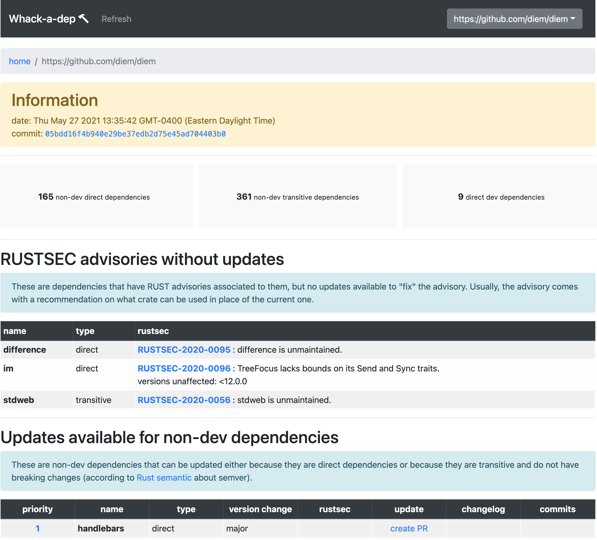

# Whack-a-Dep!

A dashboard to update your dependencies.



## Usage

To run the whole thing for development (requires [docker-compose](https://docs.docker.com/compose/)):

```sh
GITHUB_TOKEN=<PAT> make
```

where PAT is an optional personnal access token for Github ([see steps here on how to create one](https://github.com/mimoo/cargo-dephell#usage)).
If you do not specify the PAT then some features won't work (for example, changelogs).

This will re-build everything all the time, if you know there hasn't been any changes lately you can simply run:

```sh
GITHUB_TOKEN=<PAT> make fast
```

These commands will run the following four services:

* a web frontend on http://localhost:8080
* an API backend on http://localhost:8081
* a mongodb server on http://localhost:27017
* a mongodb UI on http://localhost:8082

### Advanced usage

This dev setup has hot reload for the front end (you can change front end files, and it'll get reflected) but not for the backend.

To rebuild the backend (or frontend) you can use:

```sh
GITHUB_TOKEN=<PAT> make restart-backend
```

To SSH into the backend (or frontend) you can use:

```sh
make ssh-backend
```

## Architecture


The architecture looks like the following:

- [web-frontend](web-frontend). This is the web dashboard built on top of [Bootstrap-Vue](https://bootstrap-vue.org/). It queries the web backend to obtain information on dependencies.
- [web-backend](web-backend). This is the dashboard that you use to manage your dependencies. It is written with the [Rocket](https://rocket.rs/) web framework. It also serves a **metrics** API built on top of the [metrics](web-backend/metrics) crate.
- [db](db). This is the [Mongodb](https://www.mongodb.com/) database where information about dependencies throughout the lifetime of the codebase are persisted.
- [cronjobs](cronjobs). These are cronjobs that call the backend's metric API periodically in order to check if new dependency upgrades are available. (They don't work at the moment!)

## Metrics

Metrics on dependencies are obtained via a **metrics** service within the [web-backend](web-backend).
The service is implemented using the [metrics](web-backend/metrics) crate.


Essentially, what the service does when called is:

1. Pull the latest changes from the specified repository.
2. **fetch**. Parse any dependency file (e.g. `Cargo.toml`) to obtain a list of dependencies.
3. **find updates**. Check if any of these dependencies have updates (for example, by querying crates.io).
4. **priority engine**. Check how urgent these updates are (for example, by checking output of cargo-audit).
5. **risk engine**. Check how shady these updates are (for example, by checking red flags on Github)
6. **store**. Store this information in mongodb under a new `_id`.

Note that for steps 2 and 3, [dependabot](https://github.com/dependabot/dependabot-core/blob/e207e5810b/cargo/lib/dependabot/cargo/file_updater/manifest_updater.rb) has code that handles many types of file and package manager (Rust, Dockerfile, npm, etc.)
While we do use it, we want to perform more granular analysis on our Rust dependency.
For example, we want to understand what updates are more urgent than others based on semver, breaking changes, [RUSTSEC advisories](https://rustsec.org/), Github statistics, dev dependency, etc.
For this reason, we use custom code (built on top of [guppy](https://github.com/facebookincubator/cargo-guppy/)) to analyze parts of Rust dependencies.

### How to add rules to the priority engine

* [web-backend/metrics/src/rust/mod.rs](web-backend/metrics/src/rust/mod.rs) contains a `priority()` function that runs all the priority rules, and modify the vector of dependencies in place according to what it finds.
* You might have to modify fields of the `RustAnalysis` structure to store these signals. This will invalidate previous analysis, but it is not a big deal.
* [web-frontend/src/components/Dashboard.vue](web-frontend/src/engines/priority.js) contains a `calculate_priority_score()` function that you can modify to increase (or decrease) the score depending on your signal, and to display a reason to the user (which will appear when they hsover the priority column of the UI's tables).

### How to add rules to the risk engine

* [web-backend/metrics/src/rust/mod.rs](web-backend/metrics/src/rust/mod.rs) contains a `risk()` function that runs all the priority rules, and modify the vector of dependencies in place according to what it finds.
* You might have to modify fields of the `RustAnalysis` structure to store these signals. This will invalidate previous analysis, but it is not a big deal.
* [web-frontend/src/components/Dashboard.vue](web-frontend/src/engines/risk.js) contains a `calculate_risk_score()` function that you can modify to increase (or decrease) the score depending on your signal, and to display a reason to the user (which will appear in the "review" pages if there's a risk score > 0).

## Deployment

We use kubernetes for deploying the app. Check [k8s](k8s/) for more information.
